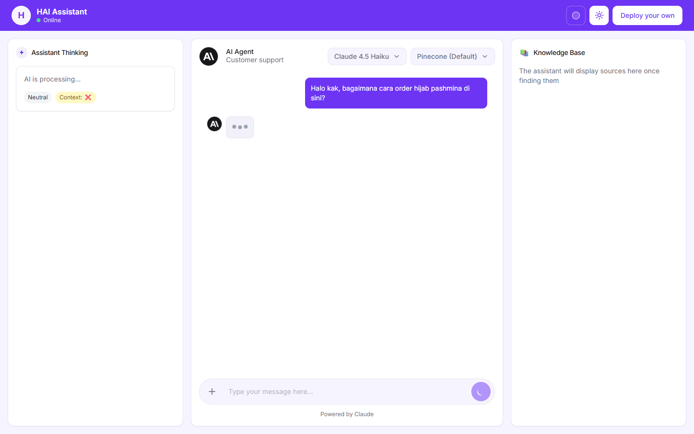
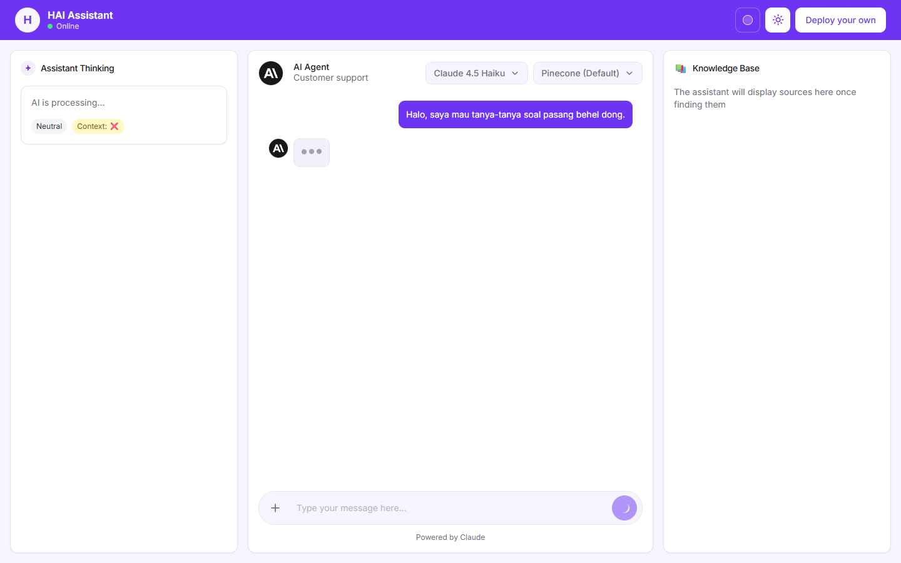
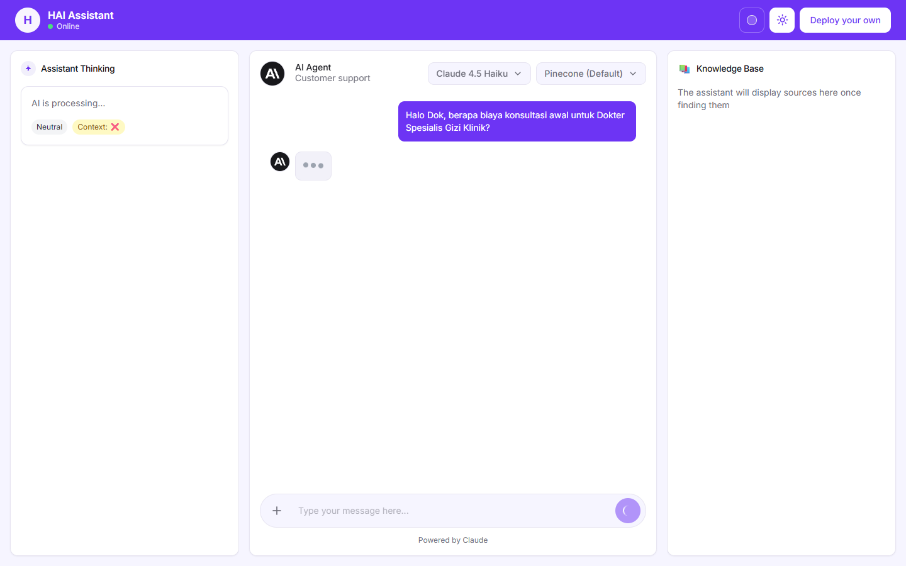

# AI Customer Support & Booking Agent

> Multi-tenant AI customer-support platform for Indonesian SMBs — one codebase that adapts to each client's brand, knowledge base, and workflow. Built with **Claude AI + RAG**, live human handoff, WhatsApp, appointment booking, and an admin dashboard.

**🔗 Live demo:** **[customer-support-agent-alpha.vercel.app](https://customer-support-agent-alpha.vercel.app/)** &nbsp;·&nbsp; **Admin dashboard:** [/admin/dashboard](https://customer-support-agent-alpha.vercel.app/admin/dashboard)
&nbsp;·&nbsp; **Stack:** Next.js 14 · TypeScript · Claude · Pinecone · Prisma/PostgreSQL

> Try it: type in **English or Indonesian** — ask about prices, book an appointment, or ask a tricky one like *"is a facial safe during pregnancy?"* and watch the assistant reason, detect mood, and hand off safely.

---

## What it does

Small businesses lose customers to slow replies. This agent answers customer questions instantly and accurately — grounded in each client's **own** knowledge base (no hallucinated answers) — and escalates to a human the moment it can't help.

It's **multi-tenant**: the same deployment serves many businesses at once, each with its own identity, contact details, FAQ, and scope. It currently ships with demo knowledge bases for **35+ beauty & dental clinics** (with appointment booking) and an **e-commerce store** (with order tracking, payment, and inventory).

## Demo

| Retail (hijab shop) | Orthodontics clinic |
|---|---|
|  |  |

| Aesthetic clinic (SPKK) | Aesthetic clinic (SPGK) |
|---|---|
|  |  |

## Key features

- **Grounded RAG answers** — semantic search over each client's KB via Pinecone, with embeddings generated by Pinecone Inference (`multilingual-e5-large`, strong Indonesian/English). Answers cite their source; the bot won't invent facts.
- **Native Tool Use** — Claude calls real functions for live data: order tracking, payment verification, inventory checks, and appointment availability/booking (Postgres-backed).
- **Multi-tenant routing** — per-client identity, contact info, and scope. Add a new business by dropping in a KB file — no code changes.
- **Human handoff** — auto-detects complex or frustrated conversations, escalates to a live agent, and notifies via email (Resend). Agents take over in a real-time chat view.
- **Admin dashboard** — conversation monitoring, live SSE chat, analytics, sales funnel, and a self-improving "auto-learning" loop that turns resolved tickets into new KB entries.
- **WhatsApp integration** — Twilio WhatsApp Business API + `whatsapp-web.js` for real-time messaging.
- **Multilingual** — auto-detects and replies in Indonesian or English, with customer-mood and category detection.

## Tech stack

| Layer | Tech |
|---|---|
| Framework | Next.js 14 (App Router), React 18, TypeScript (strict) |
| AI | Claude (Anthropic SDK + AI SDK), native Tool Use |
| RAG | Pinecone vector DB + Pinecone Inference embeddings (multilingual-e5-large) |
| Data | PostgreSQL + Prisma ORM |
| Realtime | Server-Sent Events (live chat & activity feed) |
| Integrations | Twilio / whatsapp-web.js · Resend (email) |
| UI | Tailwind CSS · shadcn/ui · Recharts |
| Deploy | Vercel (serverless + cron) |

## Architecture at a glance

```
Customer (Web / WhatsApp)
        │
        ▼
  Next.js API  ──►  Claude (tool use)  ──►  Postgres (orders, bookings, inventory)
        │                   │
        │                   └──►  Pinecone RAG  ◄── per-client knowledge base
        ▼
  Handoff engine ──► Admin dashboard (live SSE) ──► Human agent + email alert
```

Deeper docs live in [`/docs`](docs/README.md) — architecture, multi-tenancy, RAG setup, deployment, and testing.

## Run locally

```bash
git clone https://github.com/HIIDAAYY/Anthropic-Chatbot.git
cd Anthropic-Chatbot/customer-support-agent
npm install
cp .env.example .env.local   # fill in your API keys
docker-compose up -d          # local PostgreSQL
npx prisma migrate deploy
npm run dev                    # http://localhost:3000
```

Required keys: `ANTHROPIC_API_KEY`, `PINECONE_API_KEY`, `DATABASE_URL` (embeddings run through Pinecone Inference, so no separate embeddings key is needed). WhatsApp/email keys are optional for local use. See [`.env.example`](.env.example) for the full list and [`docs/QUICK_START.md`](docs/QUICK_START.md) for details.

**UI variants:** `npm run dev:chat` (chat only) · `npm run dev:left` / `npm run dev:right` (single sidebar) · `npm run dev` (full).

## Deploy

Deploys to **Vercel** in a few clicks — see [`docs/VERCEL_DEPLOYMENT_GUIDE.md`](docs/VERCEL_DEPLOYMENT_GUIDE.md). Set the same environment variables in the Vercel dashboard. Live demo currently runs at **[customer-support-agent-alpha.vercel.app](https://customer-support-agent-alpha.vercel.app/)**.

---

## About

Built by [@HIIDAAYY](https://github.com/HIIDAAYY). Available for freelance work — AI chatbots, RAG systems, and customer-support automation for SMBs. This repo is a portfolio demonstration; production client deployments are private.
